# 如何使用命令行AI Agent

Lazenca

## 概况

Gemini CLI和Claude Code是Google和Anthropic提供了命令行AI agent工具，agent与Chatbot的不同之处在于，agent在Terminal（bash、cmd、Powershell）中运行，我们可以授权agent一定的系统权限，直接修改文件、代码甚至可以自动进行调试与debug。其他相关工具也有Cursor，但Cursor是一个单独的IDE，而前两者不需要更换IDE，而与Vscode的其他AI插件（比如Cline、Github Copilot）相比，这类插件主要提供类似于Chatbot的功能并且有代码补全、生成测试的功能，而命令行agent可以直接扫描目录，而非当前打开的代码文件，提供更项目化的上下文，并且可以利用系统权限直接操作文件，可以进行文件管理、撰写README等工作。

目前为止（2025.7.11），Gemini CLI是免费的，默认使用Gemini 2.5 Pro模型，Tokens用量接近于无限（很难想象每天1000次调用能用得完），只需要使用Google登陆即可，而Claude Code据称比Gemini CLI、Cursor都要强很多，但付费高昂，200美金的订阅才能爽用，用量不大的话可以使用API计费，Anthropic认为一个职业的程序员开发团队一个月人均的使用成本约为60-70美元（此乃谎言！）。

2025.7.17：介绍了Github Copilot的使用。

我接下来提供Win下的使用方法，实测有效。

## 科学上网

在使用命令行工具的全程都需要使用魔法，除非使用国内中转站，我使用了Claude Code的中转站，但是Gemini CLI仍然需要全程使用魔法。

首先需要一个靠谱的魔法软件，最好需要有以下功能：修改端口，TUN模式，系统代理，自定义代理规则。如果有其他的梯子的订阅没用完，至少得有全局代理和修改端口的功能，但不保证成功，这是因为，使用CLI工具需要让Terminal和WSL也能够通过代理。

以Clash为例，我使用了iKuuu机场提供的定制Clash客户端和配置方案，根据网页教程配置完成之后，关闭端口随机，选择一个自己想要的端口，然后打开TUN模式，启动系统代理，最好用美国节点。

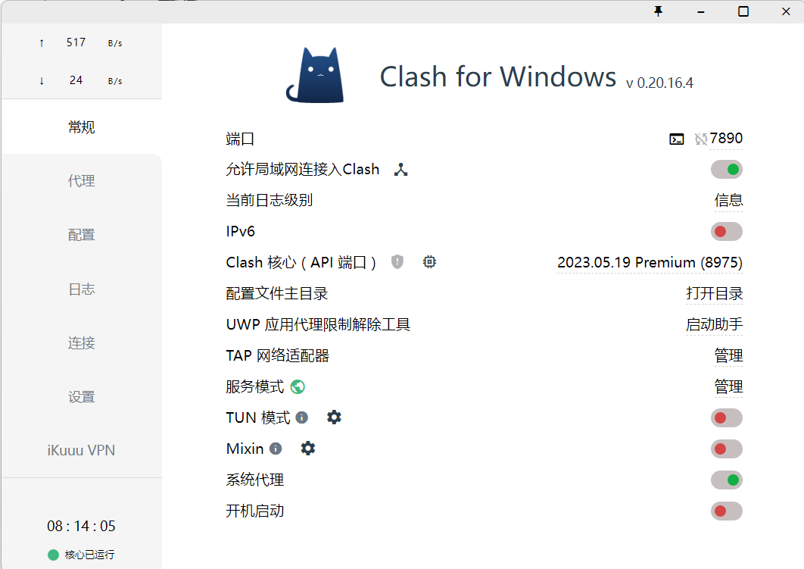

然后修改系统代理，在Win11的设置-网络和Internet-代理中，使用手动设置代理，打开并编辑端口与Clash一致，系统会根据配置方案生成白名单。

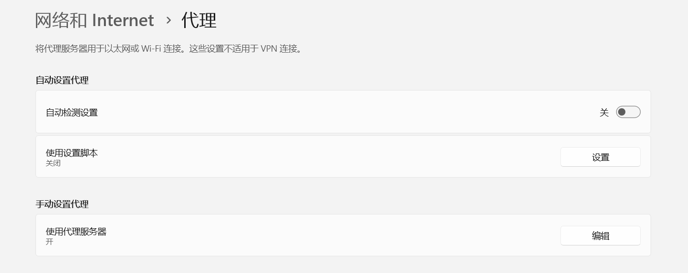

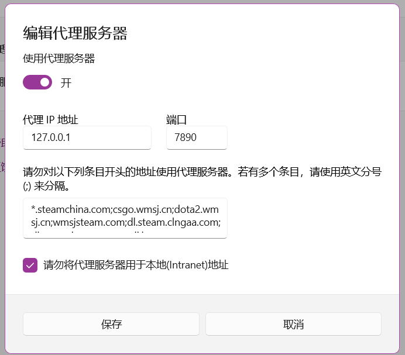

之后，修改系统的环境变量（直接在设置中搜索修改系统环境变量），也可以在命令行中修改。

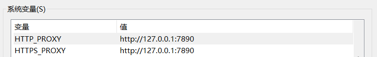

新建两个新的系统变量，7890改为你需要的端口。同时也可以再新建两个全部为小写的变量，一般而言两者会相互替换，保留全大写的就可以了，只有全小写的系统变量似乎不能够成功代理。WSL一般而言会直接继承外部的系统代理。到此为止网络设置完成。可以测试一下在Terminal中是否能够访问外网。

```cmd
curl -vvk google.com
```

## Gemini CLI

### 安装并运行

Gemini CLI支持直接在Windows下运行，我们直接全局安装，也可以使用npx一次性使用。

先根据网络教程安装node.js，此处略过，确保下列命令可以输出。

```powershell
node -v
npm -v
```

然后在命令行中运行（也可以直接在Powershell中运行，这样可以跳过3.2）。

```cmd
npm install -g @google/gemini-cli
```

这样就安装完成了，在登陆之前，我们先确保我们的Google账户有相关权限。进入https://console.cloud.google.com/，进入API和服务。点击“启用API和服务”。


搜索Gemini，然后将下列三个全部启用。

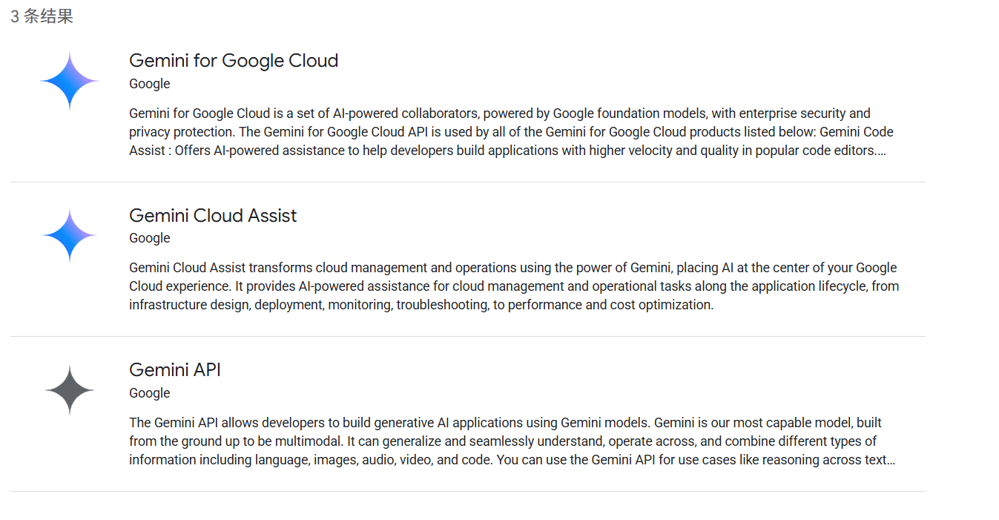

然后在系统环境变量中加入Google Cloud的项目ID。

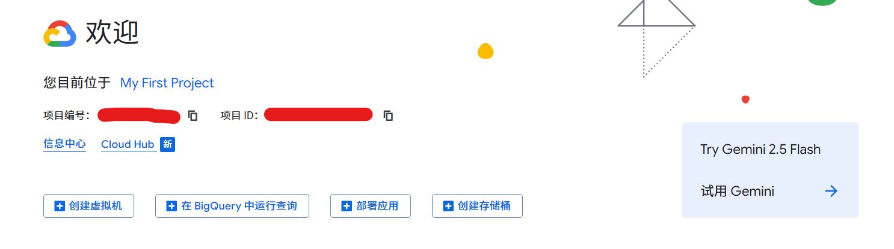

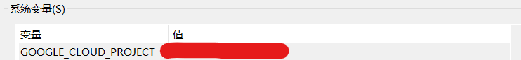

然后在cmd中输入gemini，跟随他一步一步登陆就好啦！

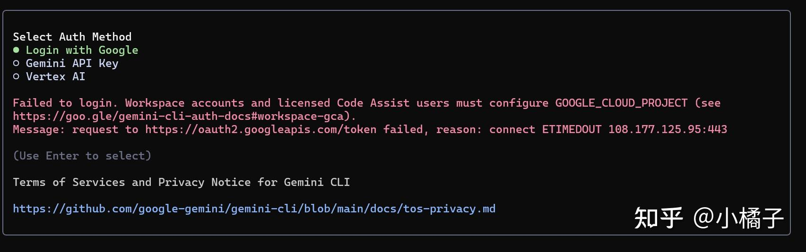

在这三项中选第一个，如果觉得用的多了模型变笨了，可以用API Key。

实测，不翻墙也可以正常使用，但是他会经常让你重新登陆，此时需要保证网络环境完整配置。

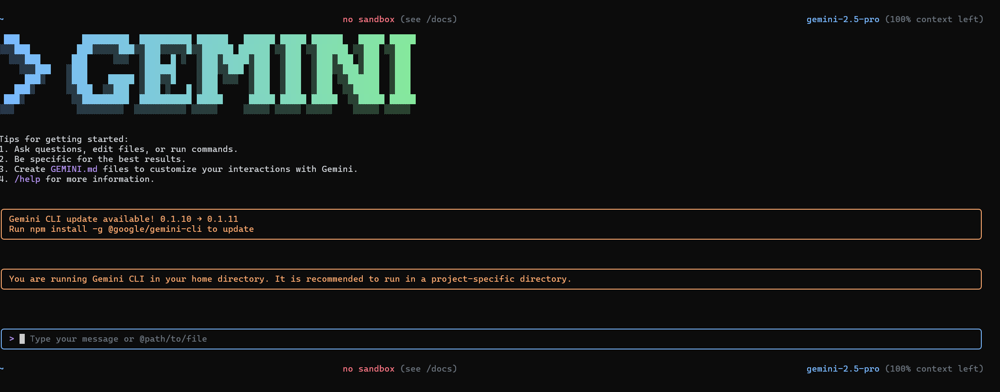

### 在Vscode中使用Gemini CLI

Vscode中可以直接调出Terminal，但是默认的Terminal是Powershell，可以输入cmd进入命令行再输入gemini启动，也可以新建一个cmd的Terminal使用，接下来我们让Powershell也可以直接启动gemini。

在开始菜单中以管理员身份运行Powershell，然后输入`Get-ExecutionPolicy`查看当前执行策略。然后输入

```
Set-ExecutionPolicy RemoteSigned
```

允许外部脚本运行，此时`Get-ExecutionPolicy`的结果应该是

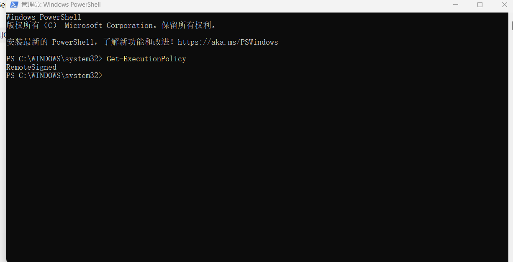

此时可以直接在Powershell中输入gemini启动，在Vscode中也可以直接输入gemini启动。

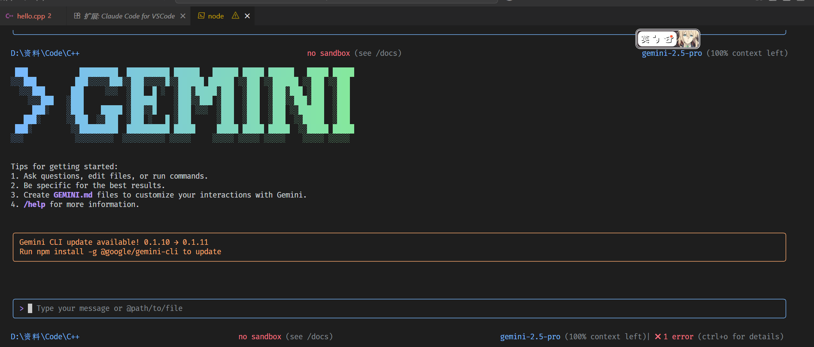

## Claude Code

> [!NOTE]
>
> 2025.7.15，Anthropic发布了Windows原生的Claude Code，可以直接跳过4.1 安装WSL，直接在命令行中安装Claude Code了。请自行搜索Windows安装node.js并且运行npm install -g @anthropic-ai/claude-code

### 安装WSL

在控制面板-程序和功能-启用或关闭Windows功能中，开启Virtual Machine Platform（Windows虚拟机监控程序平台）与Windows Subsystem for Linux Support（适用于Linux的Windows子系统）。Win11再开启Windows Hypervisor Platform（可能没有）和Hyper-V。

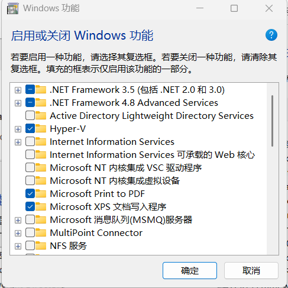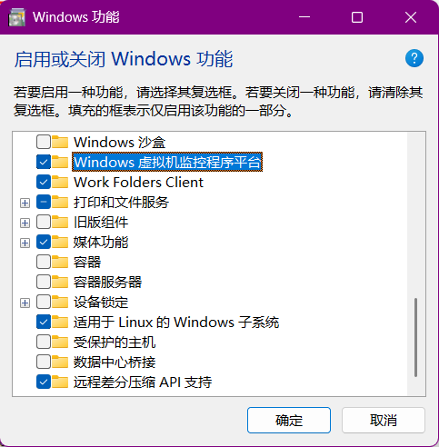

可以选择将WSL版本设定为WSL2。
```cmd
wsl --set-default-version 2
```

安装Ubuntu，版本任选。

```cmd
wsl --install -d Ubuntu - 20.04
```

在开始面板搜索Ubuntu，启动WSL，或者在命令行启动WSL。

```cmd
wsl -d Ubuntu
```

### 安装ClaudeCode

建议先看到4.2.1的结尾。

#### 官方版本

在WSL里安装node.js。

```bash
curl -fsSL https://deb.nodesource.com/setup_lts.x | sudo bash -
sudo apt-get install -y nodejs
node --version
```

然后可以安装Claude Code。

```bash
npm install -g @anthropic-ai/claude-code
claude --version
```

接下来可以在魔法环境下启动，选择主题，然后回车登陆。

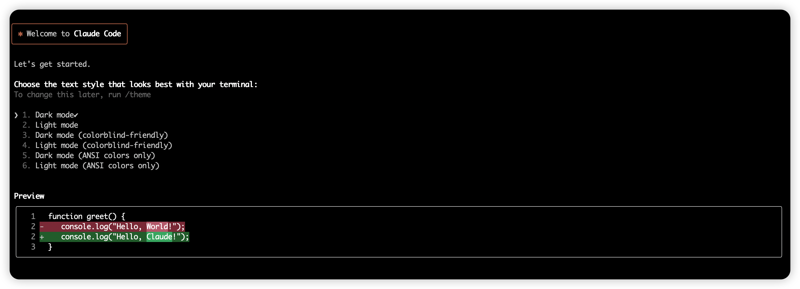

会自动跳转到Anthropic的网站，登录后我发现，我的Google账户被Anthropic封了（反华企业！！）

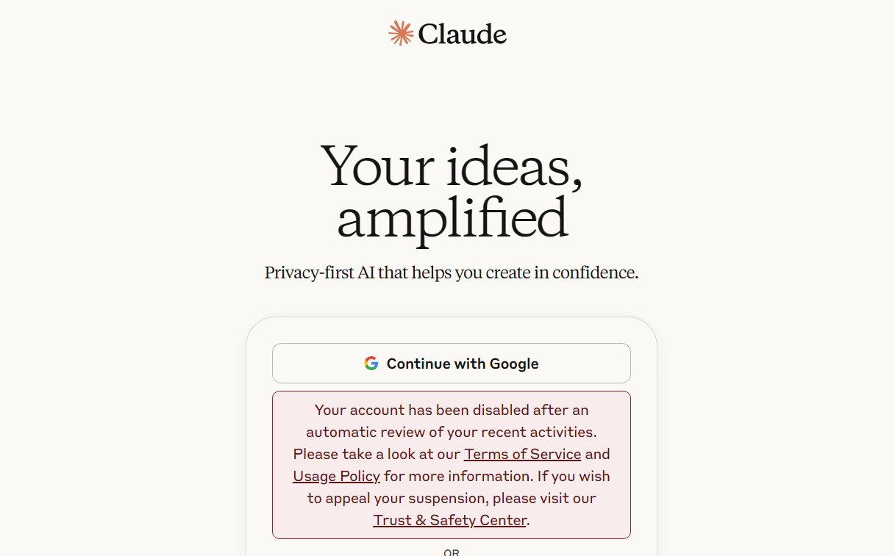

#### 国内中转站与其他模型

为了解决Anthropic对于中国包括港澳地区的IP动辄封号的行为，我们只能使用中转站（API聚合平台或镜像），使用了国内的中转站，不需要使用魔法，网络环境相对稳定一些。

##### Anyrouter

> [!WARNING]
>
> 这个免费网站非常慢，并且很有可能是骗子，搞一些赠送福利后大批量封号的把戏，但是命令行工具的Tokens消耗是非常大的，非要白嫖也不是不行。

https://anyrouter.top/register?aff=fjIS

复制API，然后配置环境变量，修改Claude Code的API地址为中转站，将每一行的“sk-…”替换为API令牌。

> [!NOTE]
>
> 对于Windows原生Claude Code，在C:\Users\User_name\\.claude中直接修改setting.json文件即可。

```bash
echo -e '\n export ANTHROPIC_AUTH_TOKEN=sk-...' >> ~/.bash_profile
echo -e '\n export ANTHROPIC_BASE_URL=https://anyrouter.top' >> ~/.bash_profile
echo -e '\n export ANTHROPIC_AUTH_TOKEN=sk-...' >> ~/.bashrc
echo -e '\n export ANTHROPIC_BASE_URL=https://anyrouter.top' >> ~/.bashrc
echo -e '\n export ANTHROPIC_AUTH_TOKEN=sk-...' >> ~/.zshrc
echo -e '\n export ANTHROPIC_BASE_URL=https://anyrouter.top' >> ~/.zshrc
```

运行 `source ~/.bashrc`让环境变量生效。然后启动。

```bash
claude
```

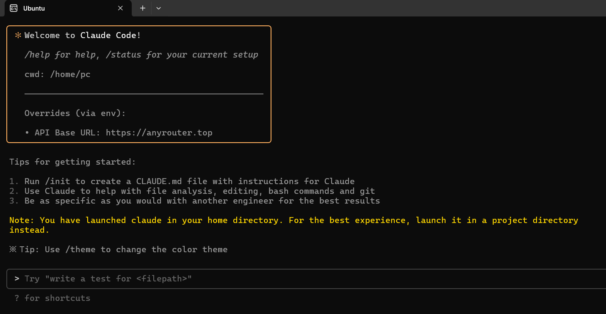

##### API易

https://api.wentuo.ai/ ，存在一定逆向与模型降级行为。
```bash
export ANTHROPIC_API_KEY="sk-"
export ANTHROPIC_BASE_URL="https://api.wentuo.ai"
```

> [!WARNING]
>
> 使用国内中转站可能存在数据风险，需要谨慎授予权限和配置环境，并且，不建议使用中转站专门提供的Claude Code安装包，风险性更高。
>
> 即便是为了省钱，也建议细致地写好.claudeignore文件和CLAUDE.md作为默认提示词，不然他乱扫一通之后就会吞掉巨量的cache tokens。

##### Kimi K2

月之暗面推出的Kimi K2模型强调编程与Agent能力的模型，并且推出了Anthropic格式的api，以支持Claude Code的使用，详情参见https://platform.moonshot.cn/docs/guide/agent-support#%E8%8E%B7%E5%8F%96-api-key

> [!TIP]
>
> 月之暗面针对账户充值金额有速率限制，请查询相关文档与网络使用心得。

##### Openrouter

现在还没有开通Claude Code支持。

### 在Vscode中使用Claude Code（TODO）

当然，Vscode也是可以在Terminal直接启动WSL的，此时直接输入claude就可以启动。（2025.7.15）安装Windows版之后，直接在Powershell即可启动。

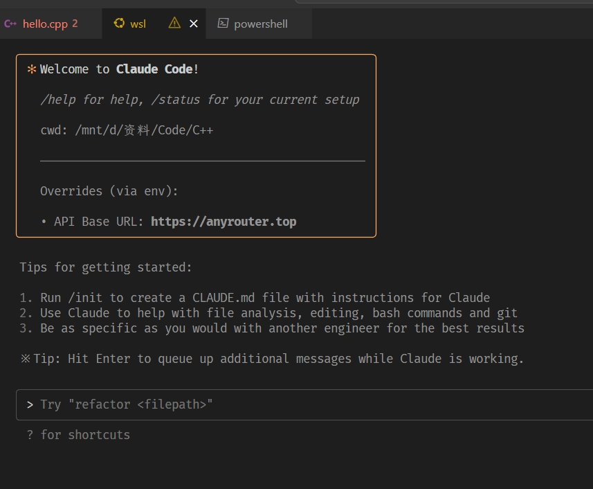

Anthropic也在Vscode提供了Claude Code插件，会在编辑器左上角快速进入，并且会自动将所在的文件与选中的代码作为上下文输入。

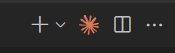

## Github Copilot

Vscode内置的Github Copilot也具有相当强的Agent能力，并且售价相对便宜（Pro 10美元/M，Pro+39美元/M），更重要的是，**通过Github学生认证之后，即可免费使用Pro**。


